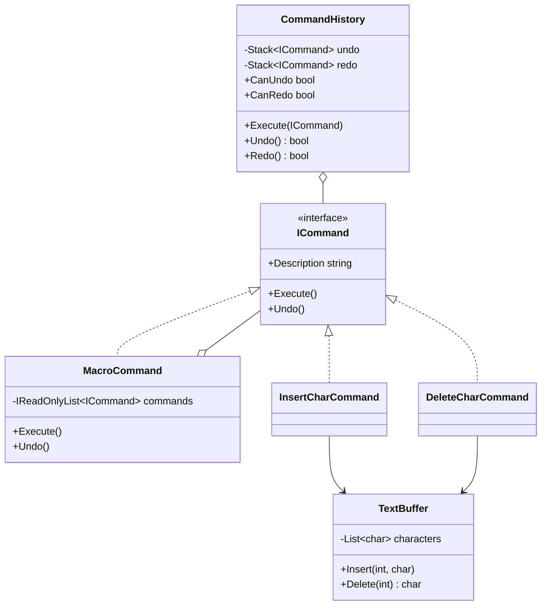
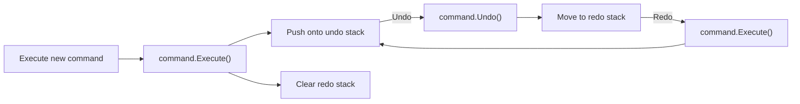
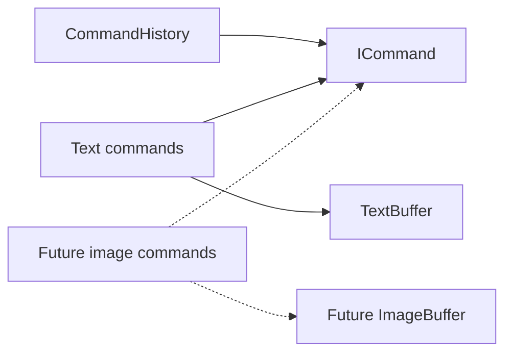

# BufferCommandHistory

An extensible command-history core with multi-level undo/redo, redo invalidation, macro commands, and a deterministic text-buffer demonstration.

The Command pattern fits undo and redo because each operation is an object that knows how to apply and reverse one change. `CommandHistory` only coordinates `ICommand` instances; it has no dependency on text, buffers, characters, or any future domain.

## Architecture



The dependencies point inward toward the generic command contract. `TextBuffer` exposes primitive mutations and owns no history. Text commands store only the state needed to reverse their own operations.

## Undo and redo lifecycle



Redo deliberately calls `Execute()` again, so commands follow this lifecycle:

```text
Execute -> Undo -> Execute -> Undo -> ...
```

Stack transitions happen only after the command operation succeeds. If a new execute, undo, or redo operation throws, the command is not lost from its existing history side. Exceptions are propagated to the caller.

## Redo invalidation

Undoing creates a possible redo path. Executing a new command from that earlier state creates a divergent history, so all redo entries are cleared after the new command executes successfully.

```text
Execute A -> Execute B -> Execute C -> Undo C -> Undo B -> Execute X

Active history: A, X
Redo history:   empty
```

If `X.Execute()` throws, the existing redo path remains intact.

## Macro commands

`MacroCommand` composes one or more `ICommand` objects into a single history entry. Children execute in declaration order and undo in reverse order:

```text
Execute: A, B, C
Undo:    C, B, A
```

The command enumeration is materialized once, and blank descriptions, empty macros, and null children are rejected. Macros are intentionally not transactional in this version: a child exception is propagated, and generalized rollback of previously executed children is not attempted. Macro children should therefore be valid for their target state.

## Console demonstration

The console application is scripted, deterministic, and requires no input. It demonstrates individual insertions, multi-level undo/redo, redo invalidation, deletion, and a multi-character macro that occupies one history entry.

Example excerpt:

```text
BUFFER COMMAND HISTORY
======================

PHASE 3 - REDO INVALIDATION
---------------------------
[11] Execute: Insert '?' at 4
Buffer: "Hell?"
Undo: 5 | Redo: 0
Can redo after divergent edit: False
```

## Build, test, and run

```bash
dotnet restore
dotnet build
dotnet test
dotnet run --project src/BufferCommandHistory
```

## Future extension

An image-buffer phase can add types such as `ImageBuffer`, `SetPixelCommand`, and `FillRegionCommand`, each implementing the same `ICommand` contract where appropriate. That extension should require no changes to `ICommand`, `CommandHistory`, or `MacroCommand`.



Image manipulation is intentionally not implemented in this phase.

## Design trade-offs

- Commands retain minimal reversal data rather than full-buffer snapshots.
- The history is linear; executing after undo discards the redo branch.
- `MacroCommand` provides composition but not transactional rollback.
- There is no `IBuffer` or generic `CommandHistory<T>` because reuse comes from depending on `ICommand`, not from forcing unrelated mutable targets into one hierarchy.
- Persistence, event sourcing, async commands, GUI concerns, and dependency injection remain outside this focused core.
